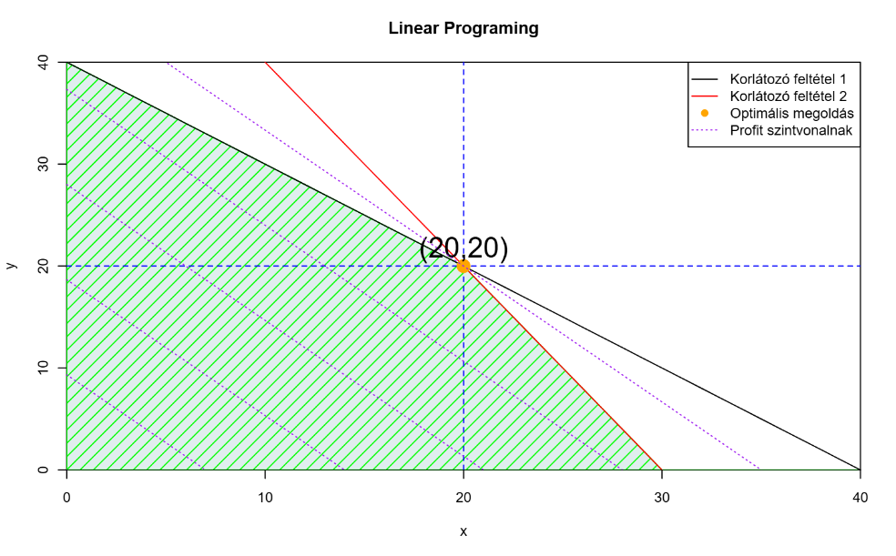

# Operációkutatás Linear Programming in R

Simple program to solve the following linear programing problem in R.
$$max(Z) = {4x+3y}.$$

$$x1  = {x+ y <= 40}.$$
$$x2  = {2x+ y <= 60}.$$
$${x,y>=0}.$$

Online R interpreter:https://webr.r-wasm.org/latest/

